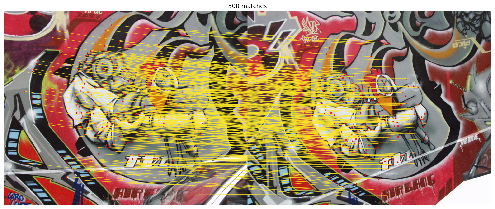

# LightGlue From Scratch

A from-scratch reimplementation of [LightGlue](https://github.com/cvg/LightGlue)
(ICCV 2023, CVG @ ETH Zurich) + its [SuperPoint](https://arxiv.org/abs/1712.07629)
front-end — written to deeply understand the model, **verified numerically
identical** to the official pretrained weights, plus a minimal training loop.



## What's inside

| Piece | Where | Notes |
|-------|-------|-------|
| SuperPoint extractor | `src/superpoint.py` | VGG encoder, 65-bin detector, sampled descriptors |
| LightGlue matcher | `src/lightglue.py` | RoPE-style posenc, self/cross attention, dustbin assignment, adaptive depth+width |
| Weight converter | `scripts/convert_weights.py` | renames official ckpt keys to this codebase |
| Equivalence checks | `scripts/verify_{superpoint,lightglue}.py` | bitwise-identical matches vs official impl |
| Pair demo + viz | `scripts/run_match.py` | saves `results/*.png` |
| CPU benchmark | `scripts/benchmark.py` | parity with official impl |
| Mini training loop | `scripts/train_mini.py` | homography-supervised, CPU-friendly |
| SIFT extractor + NN baseline | `src/sift.py`, `src/matcher_nn.py` | OpenCV SIFT + RootSIFT, mutual-NN/ratio baseline |
| UAV benchmark | `scripts/uav_benchmark.py` | 24 homography-verified aerial pairs, 4 metrics |
| Chinese study notes | `docs/00`–`06` | step-by-step walkthrough |

## UAV Visual Matching Benchmark

Real UAV photos (OpenDroneMap Aukerman) warped by random homographies →
24 pairs with exact ground truth. Full report: `docs/06-benchmark.md`.


| Method | Matches | GT precision | RANSAC inlier | Latency (CPU) |
|--------|---------|--------------|---------------|---------------|
| SIFT + NN | 545 | 88.7% | 88.7% | 68ms |
| SuperPoint + NN | 718 | 95.5% | 95.4% | 634ms |
| SIFT + LightGlue | 620 | **96.8%** | 96.8% | 232ms |
| SuperPoint + LightGlue | **801** | **97.1%** | 97.1% | 709ms |

Takeaways: the learned matcher lifts SIFT by +8pt precision and adds
~47% more matches for SuperPoint; SuperPoint+LightGlue scales with
input resolution (855 matches @1536px) while SIFT saturates ~500.

## Verification (the point of this repo)

On `graf` image pairs, loading converted official weights:

- **SuperPoint**: keypoints / scores / descriptors — max abs diff **0.0**
- **LightGlue**: identical match indices, identical early-stop layer,
  identical pruning trajectory, match-score diff **0.0**
- Benchmark on CPU (Intel-class cloud core, batch=1):

| keypoints | ours (ms) | official (ms) |
|-----------|-----------|---------------|
| 256       | 10.9      | 10.7          |
| 512       | 16.6      | 17.7          |
| 1024      | 45.8      | 42.6          |
| 2048      | 128.2     | 153.9         |

## Quick start

```bash
pip install torch torchvision kornia opencv-python matplotlib numpy
python scripts/convert_weights.py        # fetch + convert official ckpts
python scripts/run_match.py data/oxford/graf/img1.ppm data/oxford/graf/img2.ppm
python scripts/verify_lightglue.py       # requires the official repo for reference
python scripts/train_mini.py --steps 150
```

Test images: Oxford Affine Covariant sequences
(`graf`, `wall`, `boat`, …) — each sequence ships 6 images related by
ground-truth homographies, which double as training supervision.

## Design notes / deviations from the official repo

- Eager CPU path only: no `torch.compile`, no FlashAttention branches,
  no autocast wrappers — the manual cross-attention math path is what
  the official code itself runs on CPU, hence bitwise-equal scores.
- Simplified public API (`extract`/`match_pair`) with the same shapes.
- The training script is a scaled-down demo (Oxford homographies,
  ~500 steps on CPU), not a paper-accuracy reproduction — full training
  lives in the authors' [glue-factory](https://github.com/cvg/glue-factory).

## License & attribution

This reimplementation is released for study/research. LightGlue code is
Apache-2.0; **SuperPoint's code and weights are under Magic Leap's
restrictive license** (research use only). Pretrained weights are
downloaded at runtime and are not redistributed here. If you use these
ideas, cite the original papers:

```bibtex
@inproceedings{lindenberger2023lightglue,
  author = {Lindenberger, Philipp and Sarlin, Paul-Edouard and Pollefeys, Marc},
  title = {LightGlue: Local Feature Matching at Light Speed},
  booktitle = {ICCV}, year = {2023}}
@inproceedings{detone2018superpoint,
  author = {DeTone, Daniel and Malisiewicz, Tomasz and Rabinovich, Andrew},
  title = {SuperPoint: Self-Supervised Interest Point Detection and Description},
  booktitle = {CVPRW}, year = {2018}}
```
